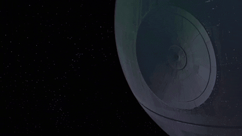

<h2 align="center">Modelling the End of the Data Lifecycle</h2>


[](https://snyk.io/test/github/datebe/destroyclaims)

## 🚀 Introduction

Data is one of the most important assets in the 21th century.
While a lot of work has been done in the field of selecting, using and transforming data for our needs, little to no work has been done when it comes to the deletion of data.
This repository is intended to contribute in closing one of the fundamental gaps concerning the end of the data life cycle.

The main contribution is a [specification](docs/destroy-claim.md) for modeling the end of the data lifecycle.
With the so-called `Destroy Claims` (written in JSON), it is possible to plan the end of the data lifecycle in advance.
It allows to model _what_, _when_, _where_, _how_, _why_ and by _whom_ data should be deleted.
The model is designed around an extension system, which allows to represent and add any use cases, even future ones.
A number of [standardized extensions](/docs/std-extensions.md) are available to start with.
Also, Destroy Claims can be used to automate the deletion of data in heterogeneous, distributed systems by providing a unified understanding.
For this purpose, Destroy Claim Agents (DCA) are used.
DCAs are connected to the environment in which the data to be deleted are located.
They evaluate Destroy Claims and execute the deletion of data in the environment.
DCAs can be developed for different purposes and technologies such as databases, file systems or web APIs.
To simplify the implementation of a DCA, a JavaScript library that can be used to easily bootstrap new DCAs is [provided](docs/destroyclaim-js.md).
The DCAs generated using the library already adhere to the Destroy Claim Model Specification.

## 📑 Documentation

+ [Destroy Claim Model 1.0.0 Specification](docs/destroy-claim.md)

+ [Standard Extensions](docs/std-extensions.md)

+ [Standard Destroy Reasons](docs/destroy-reasons.md)

+ [destroyclaim-js Library Documentation](docs/destroyclaim-js.md/)

+ [Destroy Claim JSON Schema + Standard Extensions JSON Schemas](schema/)

## 💥 Colorized footage of Destroy Claim execution



(source: https://giphy.com/gifs/starwars-star-wars-episode-4-3K0D1Dkqh9MOmLSjzW)

```json
{
  "id": "6f526380-d3fd-4ffc-86e7-720f08ff6cbc",
  "isActive": true,
  "strictMode": false,
  "title": "Destroy home planet of Leia Organa",
  "description": "Senator Leia Organa stole the Death Star plans and handed them over to the rebels. We have to find out the location of the rebel base. For this we blackmail the senator by destroying her home planet in case of non-cooperation or lie."
  "destroyContacts": [
    {
      "id": "0aef0f41-41f1-4cd3-8c1f-d974e64779f8",
      "name": "std:agent",
      "payload": {
        "name": "Moff Tarkin"
      },
      "refs": ["02faafea-1c31-4771-b90b-2e8380af06dd"]
    },
    {
      "id": "384cfe80-888e-4650-90cd-2c093ec5d918",
      "name": "std:agent",
      "payload": {
        "name": "Darth Vader"
      },
      "refs": ["02faafea-1c31-4771-b90b-2e8380af06dd"]
    },
    {
      "id": "072bd12e-65a7-4095-9616-e2a4fc1f3b47",
      "name": "std:agent",
      "payload": {
        "name": "Leia Organa"
      },
      "refs": ["9ee452d1-b649-4129-83c2-b57ef308ef20"]
    },
  ],
  "destroyReasons": [
    "https://example.com/destroyclaim/reasons/compliance/laws/crimes/betrayal-of-secrets",
    "blackmail base of the rebels"
  ],
  "destroySubjects": [
    {
      "id": "9ee452d1-b649-4129-83c2-b57ef308ef20",
      "name": "planetIdentifier",
      "payload": {
        "name": "Alderaan"
      },
      "conditions": {
        "and": [
          { "var": "9ee452d1-b649-4129-83c2-b57ef308ef20" },
          { "var": "35f33c3d-50e2-4b33-bd23-2230d5445fc2" },
          { 
            "or": [
              { "var": "bb7f2dac-6c04-4ede-93aa-bbcb8f189f88" },
              { "var": "82eedac3-75ef-425b-9834-6df9f2a32e34" },
              { "var": "2265a240-e795-4a8d-860b-e008d8188d38" }
            ] 
          }
        ]
      },
      "action": "d815f135-8723-407b-9549-aae65dae9ae8"
    }
  ],
  "destroyConditions": [
    {
      "id": "35f33c3d-50e2-4b33-bd23-2230d5445fc2",
      "name": "deathstar:inFireRange",
      "payload": {
        "planet": "Alderaan"
      }
    },
    {
      "id": "82eedac3-75ef-425b-9834-6df9f2a32e34",
      "name": "event:lie",
      "payload": {
        "by": "Leia Organa"
      }
    },
    {
      "id": "2265a240-e795-4a8d-860b-e008d8188d38",
      "name": "event:nonCooperation",
      "payload": {
        "by": "Leia Organa"
      }
    },
    {
      "id": "bb7f2dac-6c04-4ede-93aa-bbcb8f189f88",
      "name": "event:fireCommand",
      "payload": {
        "by": "Moff Tarkin"
      }
    }
  ],
  "destroyActions": [
    {
      "id": "d815f135-8723-407b-9549-aae65dae9ae8",
      "name": "destructionLevel",
      "payload": {
        "destructionLevel": "physically destroyed"
      }
    }
  ]
}
```

> 🥸 Yes, the destruction can also be completed if Leia tells the truth or is cooperative, just by Tarkins command... 

## 📃 License

+ Code and Contributions have **MIT License**

+ Images and logos have **CC BY-NC 4.0 License**

+ Documentations and Translations have **CC BY 4.0 License**

### Copyleft (c) 2023 [Daniel Tebernum](https://github.com/DaTebe)
