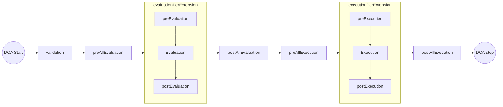

# destroyclaim-js Library Documentation

[back to homepage](../README.md)

## Table of Content

+ [Introduction](#introduction)
+ [Installation](#installation)
+ [Create your first DCA](#create-your-first-dca)
+ [Generic Lifecycle](#generic-lifecycle)
+ [Inject Evaluation Methods](#inject-evaluation-methods)
  + [Main Evaluation Method](#main-evaluation-method)
  + [Evaluation Hooks](#evaluation-hooks)
+ [Inject Execution Methods](#inject-execution-methods)
  + [Main Execution Methods](#main-execution-methods)
  + [Execution Hooks](#execution-hooks)
+ [State Management](#state-management)
+ [SupportObjectGenerator Class](#supportobjectgenerator-class)
  + [Instantiate SupportObjectGenerator](#instantiate-supportobjectgenerator)
  + [SupportObjectGenerator Methods](#supportobjectgenerator-methods)
+ [DestroyClaim Class](#destroyclaim-class)
  + [Instantiate DestroyClaim](#instantiate-destroyclaim)
  + [DestroyClaim Methods](#destroyclaim-methods)
+ [DestroyClaimValidator Class](#destroyclaimvalidator-class)
  + [Instantiate DestroyClaimValidator](#instantiate-destroyclaimvalidator)
  + [DestroyClaimValidator Methods](#destroyclaimvalidator-methods)
+ [Errors](#errors)

## Introduction

A Destroy Claim Agent (DCA) must meet several requirements described in the Destroy Claim Model Specification.
To simplify the development of individual DCAs the `destroyclaim-js` library was created.
With the help of this library, DCAs that consider the set of rules described by the Destroy Claim Model Specification can be generated in JavaScript.
The users of this library need to provide code that handles the connectivity to the environment.
For example, data connectivity must be taken care of.
Also, requirements of the extensions to be supported may require a connection to the environment, such as a data location query.

The library is independent of any extensions.
One can implement both standardized and own extensions with the help of this library.

The library implements the set of rules for the Destroy Claim Model 1.0.0 Specification.

>⚡ Each public method is described using JSDocs. So for more details take a look into the code.

>⚡ Notification mode and manual mode are not explicitly designed in this library. It is the responsibility of the user of the library to implement these modes in a specification compliant manner.

## Installation

Currently there is no npm release.
Please clone this repository.

```text
npm i https://github.com/DaTebe/destroyclaim-js
```

## Create your first DCA

We will implement a very simple DCA that only supports one type of extensions to address the data to be deleted.
For this we will use the `std:sha256` extension.
We will also only support normal mode, real mode, automated mode and silent mode.
Details about the modes can be found in the specification.

Import the `SupportObjectGenerator` and `DestroyClaim` class.
`SupportObjectGenerator` is used to configure your DCA instance.
`DestroyClaim` will allow you to evaluate and execute Destroy Claims.

```javascript
const { SupportObjectGenerator, DestroyClaim } = require("@datebe/destroyclaim-js");
```

Now we need to configure our DCA.
We will use the `SupportObjectGenerator` class to simplify the creation of the configuration object.

```javascript
const support = new SupportObjectGenerator();
support.supportNormalMode();
support.supportRealMode();
support.supportAutomatedMode();
support.supportSilentMode();
support.addSupportedVersion("1.0.0");
```

Now we must connect our DCA to our environment.
It should eventually be able to delete the data addressed by the Destroy Claim.
We use the `std:sha256` extension here and therefore need the corresponding [JSON schema](https://github.dev/DaTebe/destroyclaim-js/blob/main/docs/destroyclaim-js.md).
In the following we use a mockup connector to a file system to show how we can implement this extension.
Who is interested can find the mockup connector [here](../example/connector.js).

```javascript
const stdSha256Schema = require("../schema/std_sha256.json");

support.addDestroySubjectExtension(
  "std:sha256",
  stdSha256Schema,
  {
    evaluation: (subject) =>
      connector.sha256FileHash.exists(subject.getPayload().hash)
  },
  {
    realMode: (subject) => 
      connector.sha256FileHash.destroy(subject.getPayload().hash)
  }
);
```

That's all we need to configure for a minimal DCA.
To test our DCA we still need a Destroy Claim.

```javascript
const exampleDestroyClaim = {
  id: "02faafea-1c31-4771-b90b-2e8380af06dd",
  isActive: true,
  strictMode: false,
  notificationMode: false,
  manualMode: false,
  simulationMode: false,
  modelVersion: "1.0.0",
  title: "Delete the old PowerPoint with old CI",
  destroyReasons: ["security/integrity/malicious-data"],
  destroyContacts: [
    {
      id: "05845dd7-e9a2-4285-95da-3dd259ac8aa1",
      name: "std:agent",
      payload: {
        name: "John Doe",
      },
      refs: ["04d26d8a-0fde-4e45-afc0-02cf9cd794ca"],
    },
    {
      id: "3467e26e-6713-4d6e-a644-e5c11f8ea0d1",
      name: "std:agent",
      payload: {
        name: "Jane Doe",
      },
      refs: ["02faafea-1c31-4771-b90b-2e8380af06dd"],
    },
  ],
  destroySubjects: [
    {
      id: "04d26d8a-0fde-4e45-afc0-02cf9cd794ca",
      name: "std:sha256",
      payload: {
        hash: "9db8d89a49974784e31ec9ffe31c9ea9194bc60007663132af3d9ba71011b4af",
      },
    },
  ],
};
```

Now, we can create an instance of the `DestroyClaim` class and process it.
Should errors occur, for example regarding IO, they are thrown and can be catched and handled.

```javascript
const dc = new DestroyClaim(exampleDestroyClaim, support.getSupportObject());
try {
  await dc.process();
} catch (e) {
  console.log(e);
}
```

## Generic Lifecycle

The following figure gives a general overview of the evaluation and execution lifecycle as implemented by the library.
During the course of the documentation, we will discuss how to hook into the appropriate points in the life cycle if needed.



## Inject Evaluation Methods

This section deals with how to inject your own evaluations needed by the extensions your DCA should support.

### Main Evaluation Method

Evaluations are used in extensions to determine whether conditions to execute a Destroy Claim apply or not.
The library does not specify what these evaluation methods should look like.
This is primarily due to the almost infinite number of usage scenarios for Destroy Claims.
The only requirement is that a Boolean value is returned.
An evaluation is always dependent on the corresponding extension to which it belongs.
The following example was already given in a previous chapter:

```javascript
const stdSha256Schema = require("../schema/std_sha256.json");

support.addDestroySubjectExtension(
  "std:sha256",
  stdSha256Schema,
  {
    evaluation: (subject) =>
      connector.sha256FileHash.exists(subject.getPayload().hash)
  }
);
```

If you use the `SupportObjectGenerator` you pass the method as seen above.
The method has one parameter available.
The parameter differs depending on the type of extension you add.
When adding a `destroySubjectExtension` an instance of the [DestroySubjectExtension](../src/modules/DestroySubjectExtension.js) is made available as parameter.
`destroyContactExtensions` gives an instance of [DestroyContactExtension](../src/modules/DestroyContactExtension.js) as parameter, `destroyConditionExtensions` an instance of [DestroyConditionExtension](../src/modules/DestroyConditionExtension.js) as parameter, and `destroyActionExtension` an instance of [DestroyActionExtension](../src/modules/DestroyActionExtension.js) as parameter.
So, the self-written evaluation method can access the instance and execute methods.
The available methods are documented using JSDocs in the corresponding classes.
Above you can see how the `getPayload` method is called and the field `hash` is read from the payload.
A method for evaluation must be provided for each extension.
In the following example, since no checks are necessary, the evaluation always returns `true` :

```javascript
const stdAgentSchema = require("../schema/std_agent.json");
support.addDestroyContactExtension("std:agent", stdAgentSchema, {
  evaluation: () => true,
});
```

### Evaluation Hooks

Besides the main evaluation, other methods can be injected.
These can be used to do some preliminary work for specific situations or to send notifications to users.
There is a possibility for each extension to execute its own method both before and after the main evaluation using the `preEvaluation` and `postEvaluation` keys.
Again, an instance of the corresponding class is passed as a parameter.

An example can be seen here:

```javascript
support.addDestroySubjectExtension(
  "std:sha256",
  stdSha256Schema,
  {
    preEvaluation: (subject) => {
      console.log(`pre evaluate ${subject.getId()}`);
    },
    evaluation: (subject) =>
      connector.sha256FileHash.exists(subject.getPayload().hash),
    postEvaluation: (subject) => {
      console.log(`post evaluate result: ${subject.getEvaluationResult()}`);
    },
  },
  ...
)
```

Another place to run your own methods is before all evaluations and after all evaluations run as part of a Destroy Claim.

```javascript
support.addPreAllEvaluationHook((destroyclaim) => {
  console.log(
    `before all evaluation hook of destroy claim ${
      destroyclaim.getDestroyClaimOriginalJSON().id
    }`
  );
});

support.addPostAllEvaluationHook((destroyclaim) => {
  console.log(`after all evalúation hook of ${
    destroyclaim.getDestroyClaimOriginalJSON().id
  }`);
});
```

This time the instance of the `DestroyClaim` class is passed as parameter and you can use its methods.

## Inject Execution Methods

This section deals with how to inject your own execution methods needed by the supported extensions.
As mentioned in the Destroy Claim Model Specification, a DCA can execute actions after successful evaluation.
The library allows to inject these methods for each individual extensions.

>⚡ Return values are ignored by the DCA.

>⚡ You should catch and handle possible errors on your own. Otherwise, these will be bubbled up. 

### Main Execution Methods

When a Destroy Claim has been successfully evaluated, the DCA can perform the delete actions.
The actions must be injected specifically for each extension.
Actions only need to be injected for `destroySubjectExtension` and `destroyActionExtension`.
Methods injected in `destroySubjectExtension` are seen as default actions and must be provided (see Destroy Claim Model Specification).
Depending on whether the DCA supports the real mode or simulation mode, or both, appropriate methods must be injected.
An example can be seen here:

```javascript
const stdDestructionLevelSchema = require("../schema/std_destructionLevel.json");
support.addDestroyActionExtension(
  "std:destructionLevel",
  stdDestructionLevelSchema,
  {
    realMode: (action, subject) => {
      if (action.getPayload().destructionLevel === "deleted") {
        connector.sha256FileHash.destroy(subject.getPayload().hash);
      }
      if (action.getPayload().destructionLevel === "wiped") {
        connector.sha256FileHash.wipe(subject.getPayload().hash);
      }
    },
    simulationMode: (action, subject) => {
      if (
        action.getPayload().destructionLevel === "deleted" ||
        action.getPayload().destructionLevel === "wiped"
      ) {
        connector.sha256FileHash.simDestroy(subject.getPayload().hash);
      }
    },
  },
  ...
);
```

Here we added a method for execution in a real environment (`realMode`) and a method to simulate the deletion of data (`simulationMode`).
For `destroyActionExtension` two parameters are provided.
`action` contains the corresponding instance of `DestroyActionExtension`.
`subject` contains the corresponding instance of `DestroySubjectExtension`.

> ⚠️ when adding `realMode` or `simulationMode` method to a `destroySubjectExtension` only the `subject` parameter is provided.

### Execution Hooks

As with the evaluation, there is also the possibility to execute own methods before and after the execution.
This can be used, for example, to perform a rollback in case of errors.
A simple example can be seen here:

```javascript
support.addDestroySubjectExtension(
  "std:sha256",
  stdSha256Schema,
  {
    preProcess: (subject) => {
      console.log(`will delete ${subject.getId()}`);
    },
    realMode: (subject) => {
      connector.sha256FileHash.destroy(subject.getPayload().hash);
    },
    simulationMode: (subject) => {
      connector.sha256FileHash.simDestroy(subject.getPayload().hash);
    },
    postProcess: (subject) => {
      console.log(`deletion of ${subject.getId()} finished`);
    },
  },
  ...
);
```

Also, there is a possibility to add own methods before and after all execute methods.
The instance of the `DestroyClaim` class can be accessed here if needed.

```javascript
support.addPreAllExecuteHook((destroyclaim) => {
  console.log("pre exec. hook: I start a transaction logic...");
});
support.addPostAllExecuteHook((destroyclaim) => {
  console.log(
    "post exec. hook: when there was no error I commit, else I rollback..."
  );
});
```

## State Management

Sometimes it is necessary to store and read states over the life cycle of evaluations and executions in this library.
For this purpose the classes `DestroyClaim`, `DestroySubjectExtension`, `DestroyContactExtension`, `DestroyConditionExtension`, and `DestroyActionExtension` contain a possibility to store additional data in a state object.
The self-speaking methods `getState` and `setState` can be used for this purpose.
More details on parameters and return values are described using JSDocs.

## SupportObjectGenerator Class

This class is used to create a support object.
The support object describes, on the one hand, what the DCA supports.
On the other hand, it is used to inject functions for interaction with the environment.
The following explains how to instantiate and use the class.

### Instantiate SupportObjectGenerator

```javascript
const support = new SupportObjectGenerator();
```

### SupportObjectGenerator Methods

The methods are all documented using JSDocs and can be viewed [here](../src/modules/SupportObjectGenerator.js).

## DestroyClaim Class

This class represents a Destroy Claim.
For each DC you want to handle, you need to create an instance.
The following explains how to instantiate and use the class.

>⚡`DestroyClaimValidator` class is already part of the DestroyClaim Class. You don't need to run a validation on your own.

### Instantiate DestroyClaim

You can create an instance of the class by passing a Destroy Claim in JSON and a support object.
A support object can be created with the Support Object Generator Class.

```javascript
const destroyclaim = new DestroyClaim(exampleDestroyClaim, supportObject);
```

### DestroyClaim Methods

The methods are all documented using JSDocs and can be viewed [here](../src/modules/DestroyClaim.js).

## DestroyClaimValidator Class

The `DestroyClaimValidator` class is used to validate Destroy Claims statically and in the context of a DCA.
First, the schema of the Destroy Claim is checked.
Second, the Destroy Claim is checked against the support object of the DCA to see whether the DCA fulfills the requirements for evaluation and execution at all.

>⚡`DestroyClaimValidator` tries to perform as many tests as possible and does not stop after one error found.

### Instantiate DestroyClaimValidator

First, an instance must be created.
During the creation, the validation is already performed. 

```javascript
const Validator = new DestroyClaimValidator(destroyclaim, supportObject);
```

>⚡You need to create a new instance for each Destroy Claim you want to validate.

### DestroyClaimValidator Methods

The available methods can be used to see whether the validation was successful or which errors were detected.

|Method Name|Parameters|Return Value|Description|
|---|---|---|---|
|`validateDestroyClaim`|---|`Boolean`|Get the validation result of the Destroy Claim.|
|`getValidationErrors`|---|`[Object]`|Get the list of validation errors.|

## Errors

The library is designed according to the principle of success or throw.
Therefore, it is necessary to catch possible errors when using the `SupportObjectGenerator` or `DestroyClaim` class.
The library generates a number of [custom errors](../src/util/errors.js) that can be used for error handling.

|Error Name|Description|Notes|
|---|---|---|
|`SchemaValidationError`|thrown when a Destroy Claim or Extension with non valid schema is  (DestroyClaimValidator class only)|specific errors can be found in the `errors` field of the error|
|`ConditionsValidationError`|thrown when `conditions` fields content is not valid|conditions with errors are listed in the `conditions` field of the error|
|`DestroyReasonSupportError`|thrown in stricxt mode if reason is not supported by DCA|unsupported reasons are listed in the `reasons` field of the error|
|`ReferenceMissingError`|thrown when a reference in the Destroy Claim does not exist|missing references are listed in the `missingReferences` field of the error|
|`ExtensionNotSupportedError`|thrown in strict mode if extension is not supported by the DCA|list of non supported extensions can be found in the `nonSupportedExtensions` field of the error|
|`DeadlockDetectionError`|thrown if a deadlock in the `conditions` fields is found|deadlocks are listed in the `deadlocks` field of the error|
|`DestroyClaimValidationError`|thrown when Destroy Claim is not valid. This can be due to a wrong schema or because it is not valid in the context of this specific DCA. E.g. because it needs a non supported mode.|specific errors are listed in the `errors` field of the thrown error|
|`SupportError`|thrown when there is an error related to support features|---|
|`DestroyClaimError`|thrown when a method of the DestroyClaim class can not be executed|---|
